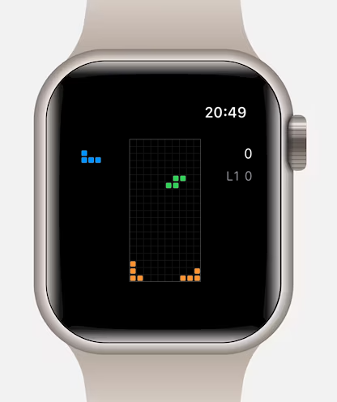

# SpinTetris

SpinTetris is a minimal watchOS SwiftUI falling-block game inspired by Tetris. It is designed for Apple Watch, with Digital Crown rotation for horizontal movement and compact on-screen gestures for rotation and hard drop.




## Features

- Native watchOS SwiftUI app
- 10x20 falling-block board
- Seven classic tetrominoes: I, O, T, S, Z, J, L
- Digital Crown left/right movement
- Single tap to rotate
- Double tap to hard drop
- Automatic falling game loop
- Collision detection and piece locking
- Line clearing
- Score, level, and cleared-line tracking
- Next-piece preview
- Game over and tap-to-restart flow
- Watch haptics for piece lock, line clear, and game over
- Canvas-based rendering optimized for a small watch display

## Build And Run

Open the project in Xcode:

```sh
open CrownBlocks.xcodeproj
```

Select the `CrownBlocks` scheme and a Watch simulator, then run.

The built app product is named `SpinTetris.app`.
